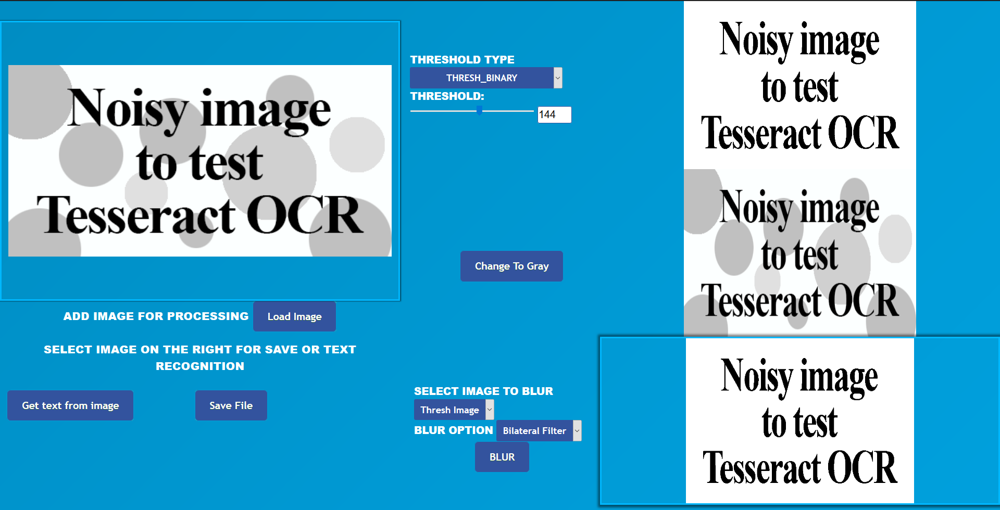
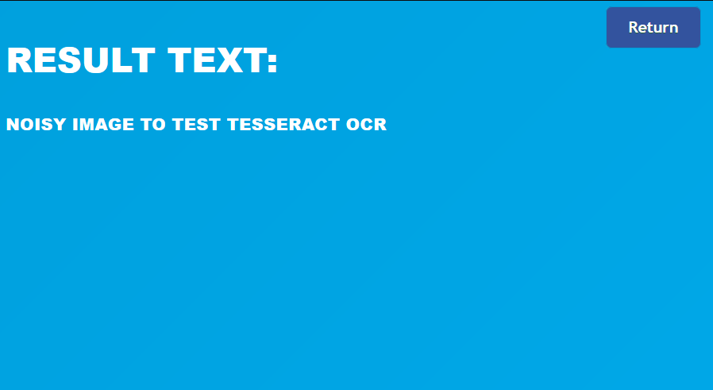

# Image to Ocr

A simple web application for image processing and text recognition from an image. Application for text recognition uses pytesseract library.

 Main used library:
 * Flask
 * Opencv.js
 * Filesaver.js
 * pytesseract

# Sample:

<b>Result:</b>

